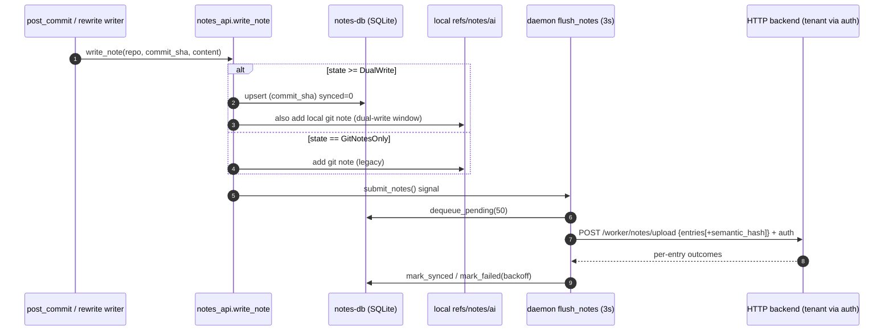
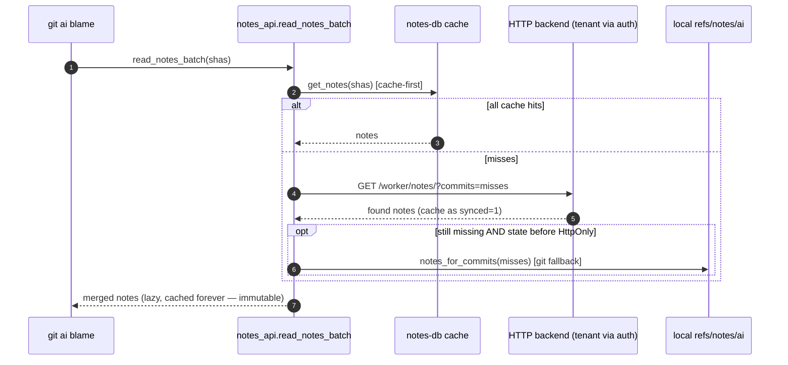
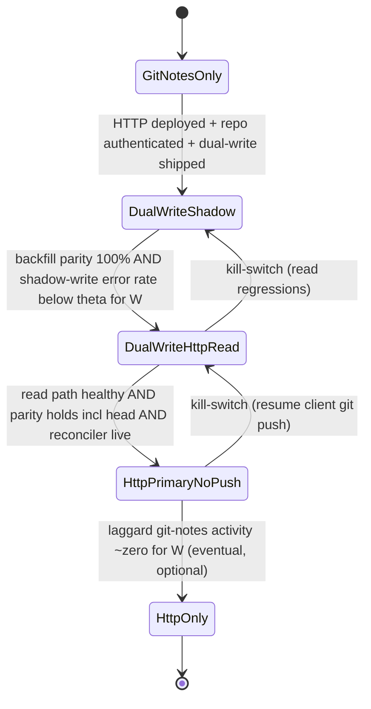
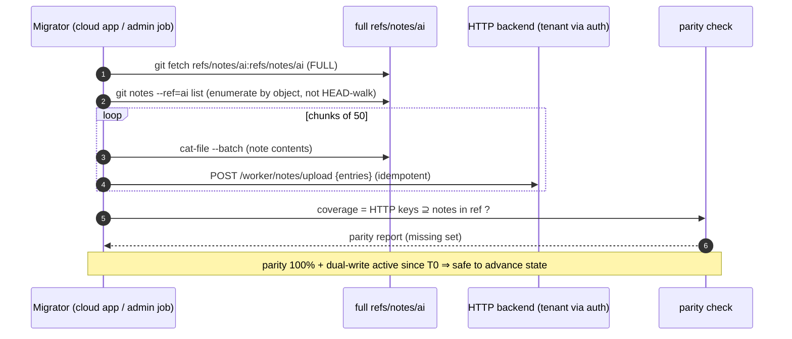

# HTTP Notes Backend — Architecture & Migration Spec

- **Status:** Draft / proposal
- **Owners:** git-ai core
- **Last updated:** 2026-06-18
- **Related:** `docs/rewrite-ops-spec.md`, `docs/daemon-trace2-ingestion-spec.md`

## 1. Motivation, goals, acceptance criteria

### 1.1 Problem

git-ai stores AI/human authorship data as git notes under `refs/notes/ai` and
mirrors them to the remote so `git ai blame` works for everyone. On high-traffic
repos this single moving ref becomes a contention point: every committer's
daemon does a **fetch → merge → push** cycle against `refs/notes/ai`, and
concurrent pushers collide on non-fast-forward rejections.

The root cause is in the push path:

> `src/git/sync_authorship.rs:296-345` — "On busy monorepos, concurrent pushers
> can cause non-fast-forward rejections **even after a successful merge**, so we
> retry the full cycle." Retry is bounded to `PUSH_NOTES_MAX_ATTEMPTS` (3).

Under enough write pressure the retries themselves contend, latency climbs, and
some notes fail to land within the attempt budget.

### 1.2 Insight

Authorship notes are used as a **key→value store** keyed by commit SHA. We do
**not** need the ordering/merge semantics that a git-notes ref provides. A
per-key KV backend removes the single-ref bottleneck entirely: independent
`commit_sha` writes never contend.

### 1.3 Goal

Move the authoritative store to an **HTTP notes backend**, independent of the
git work tree, while keeping a **local SQLite mirror** (`~/.git-ai/internal/notes-db`)
as a write-queue + read-cache. Keep `refs/notes/ai` and the local SQLite in sync
throughout the transition, with low local CPU/IO, and **stop pushing to git once
migration is complete**.

### 1.4 Acceptance criteria

| # | Criterion | How it is satisfied (summary) |
|---|-----------|-------------------------------|
| AC1 | **No user action** | Server-controlled per-repo rollout state (keyed by remote URL); daemon performs dual-write/cutover automatically. Backfill is a cloud worker (Path A) or one admin job (Path B), never an end-user action. |
| AC2 | **No data loss** | Dual-write covers the moving head; a full-visibility backfill drains history; cutover is gated on **verified parity** (`HTTP ⊇ refs/notes/ai`). A single incremental reconciler keeps capturing laggards' git-notes writes for as long as needed (§4.5). |
| AC3 | **No corruption** | Writes are immutable + idempotent per `commit_sha`; first-write-wins; divergent re-writes go to a DLQ, never overwrite. **Tenant isolation is enforced at the backend auth boundary** (§3.2), so a SHA shared across tenants never crosses accounts. |
| AC4 | **Stop pushing to git after migration** | At cutover, clients suppress the `refs/notes/ai` push refspec (keeping the local *write* for lossless rollback) — eliminating the many-writer contention. A git→HTTP reconciler (read-only on git) keeps ingesting laggards' git-notes into HTTP; the ref is fully retired (`HttpOnly`) once laggard activity decays to ~zero. No fleet-version gate. Un-upgraded clients see a partial blame until they upgrade (accepted, §4.5). |

### 1.5 Non-goals

- Changing the authorship log schema (`authorship/3.0.0`) itself.
- Replacing git-notes for users/repos that are **not** authenticated against a
  git-ai backend — they stay on the git-notes backend unchanged.
- Building the backend service itself (separate repo); this spec defines the
  **client + wire contract + migration choreography**.

---

## 2. Baseline: how notes flow today

### 2.1 Key components (as built)

| Component | Location | Role |
|-----------|----------|------|
| Push refspec | `src/git/refs.rs:12` — `AI_AUTHORSHIP_PUSH_REFSPEC = "refs/notes/ai:refs/notes/ai"` | What gets pushed to the remote |
| Push w/ retry | `src/git/sync_authorship.rs:302-345` (`push_authorship_notes`, `build_authorship_push_args:490`) | fetch→merge→push, 3 attempts |
| Fetch + merge | `src/git/sync_authorship.rs:195-282` | fetch to tracking ref, `git notes merge -s ours` (`refs.rs:765-778`), `fallback_merge_notes_ours` (`refs.rs:790-848`) |
| Triggers | `src/daemon.rs:4404-4420` | `CloneCompleted`→fetch, `PullCompleted`→fetch, `PushCompleted`→push |
| Note writers | `src/authorship/post_commit.rs:278,590`; `src/authorship/rewrite.rs:271,413`; `src/authorship/rewrite_revert.rs:205` | Generate notes from local working logs |

### 2.2 The contention, as a sequence

```mermaid
sequenceDiagram
    autonumber
    participant A as Dev A daemon
    participant B as Dev B daemon
    participant R as remote refs/notes/ai

    Note over A,B: both just committed; each has a new note to push
    A->>R: fetch refs/notes/ai
    B->>R: fetch refs/notes/ai
    A->>A: merge -s ours into local
    B->>B: merge -s ours into local
    A->>R: push refs/notes/ai (fast-forward) ✓
    B->>R: push refs/notes/ai
    R-->>B: ✗ non-fast-forward (A moved the ref)
    B->>R: retry: re-fetch + re-merge + push
    Note over B,R: under load, retries themselves collide;<br/>bounded to 3 attempts → some notes drop
```

### 2.3 Single-writer property (load-bearing for the new design)

Notes are **derived from local working logs** (`post_commit.rs:162-201`), which
only ever exist on the **committer's** machine. A developer who merely *pulls* a
commit has no working logs and therefore **cannot** produce a note for it.
Rewrites (rebase/squash/revert/cherry-pick) write notes for the **new** commit
SHAs they produce (`rewrite.rs:271,413`, `rewrite_revert.rs:205`) — never an
in-place update of an existing SHA's note. Therefore:

> **Per `commit_sha` there is exactly one legitimate writer, and a note, once
> written, is never re-derived differently by anyone else.** Combined with the
> fact that an identical SHA *is* an identical commit (same tree, parents,
> author, message), this is what makes immutable, contention-free, commit-keyed
> KV storage correct.

---

## 3. Target architecture

### 3.1 Component overview

```mermaid
flowchart TD
    subgraph client["Client machine (per developer)"]
        proxy["git proxy + git-ai daemon"]
        pc["post_commit / rewrite writers<br/>src/authorship/*"]
        api["notes_api dispatch<br/>src/git/notes_api.rs:22"]
        db[("notes-db SQLite<br/>~/.git-ai/internal/notes-db<br/>key = commit_sha")]
        flush["daemon flush loop<br/>telemetry_worker.rs flush_notes (3s)"]
        gitnotes[("local refs/notes/ai")]
    end

    subgraph backend["git-ai backend (independent of git tree)"]
        http["HTTP Notes API<br/>POST /worker/notes/upload<br/>GET /worker/notes/?commits="]
        store[("KV store<br/>logical key = commit_sha<br/>physically partitioned by tenant (auth)")]
        dlq[("DLQ + telemetry")]
        rollout["per-repo rollout/state service<br/>keyed by normalized remote URL"]
    end

    subgraph migrator["Migrator + reconciler"]
        backfill["Cold-start backfill (one-time, full enumerate)<br/>Path A: app worker · Path B: git-ai notes migrate"]
        recon["Reconciler (cadence, incremental)<br/>cursor + diff-tree, read-only on git"]
    end

    remote[("git remote<br/>refs/notes/ai")]

    pc --> api
    api -->|write| db
    api -->|dual-write window| gitnotes
    db --> flush
    flush -->|upload batch of 50 + auth (tenant)| http
    http --> store
    http -.divergent rewrite.-> dlq
    api -->|read: cache, then fetch, then git fallback| http
    proxy -->|state poll by remote URL| rollout
    backfill -->|full enumerate + upload| http
    recon -->|git→HTTP: diff-tree delta ingest| http
    recon -. incremental re-fetch (read-only) .-> remote
    gitnotes -->|client push (dual-write window only)| remote
```

### 3.2 Keying & tenancy

**Data-plane key = `commit_sha`.** The client sends `commit_sha` + content — the
shape the wire contract already has (`NoteEntry { commit_sha, content }`), so no
client-side key change is needed.

**Tenant isolation lives at the auth boundary, not in the key.** The KV store is
**physically partitioned by the authenticated tenant** derived from the request's
auth headers (`X-API-Key` / `Authorization: Bearer`, `src/api/client.rs:318-345`).
So the *logical* key is `commit_sha` but the *physical* key is effectively
`(tenant, commit_sha)`, enforced server-side. Org X can never read or clobber Org
Y's note for a SHA they happen to share.

> **Hard backend-contract requirement (load-bearing for AC3).** Because the wire
> carries no account identifier, the backend **MUST** resolve a tenant from auth
> on *every* read and write and reject any untenanted request with `401` — there is
> **no anonymous/global bucket** to fall into. Every batch operation, cache read,
> webhook ingest, and backfill path must re-check tenant per item; a lost tenant
> context mid-request must fail closed, never default-assign. DLQ records carry
> tenant context so account-confusion is attributable. This is a *backend*
> obligation (separate repo); the client cannot enforce it, so it is called out
> explicitly here and exercised by a cross-tenant mock test in the client suite
> (§7.4).

**Control-plane (migration state) is keyed by the authorship-push-target remote.**
The per-repo rollout state is a *control-plane* concern, not a note key, so it
needs its own identifier. The daemon keys state on the **specific remote it would
push `refs/notes/ai` to** (the same remote resolved by `push_remote_from_args` /
the upstream/default remote, `sync_authorship.rs:70`), polling
`GET /worker/migration-state?remote=<normalized-url>`. Keying on the *push target*
is what makes cutover coherent: "stop pushing to **this** remote" is a decision
*about that remote*, so:

- **Multiple remotes (e.g. `origin` + `upstream`)** — each push target has its
  own state; devs pushing notes to different remotes get independent, correct
  cutover decisions. No split-brain, because the suppressed push and the state
  share the same remote identity.
- **Two checkouts of the same remote** resolve to the same state (desired).
- **Normalization** is defined once (PR2): lowercase host, strip trailing `.git`,
  canonicalize SSH `git@host:org/repo` ↔ HTTPS `https://host/org/repo` to one
  form, so the two URL shapes of one repo map to one state key.
- **No remote / unauthenticated checkout** — there is no push target and nothing
  to cut over, so the repo stays `GitNotesOnly` and performs **no HTTP writes**
  (consistent with §1.5). The daemon does not poll when no authenticated push
  target exists.

For managed tenants (Path A), the cloud-app **installation id** is the equivalent
identifier.

> **Decision/assumption to confirm:** control-plane keyed by the **push-target
> remote** (cloud-app installation id for managed tenants). Alternative is a
> tenant-wide cutover (coarser, simpler, but loses per-repo ringed rollout). We
> default to per-push-target.

**Accepted residual risk (cross-repo shared SHA).** Because the key is
`commit_sha`, two *distinct* repos that share a SHA share a note key *within a
tenant*. This is benign in practice:

- An identical SHA is an identical commit, whose note is a deterministic function
  of its diff and the original author's working log — so the content is the same
  and immutability/`semantic_hash` makes a re-write an **idempotent no-op**.
- A *divergent* note for a shared SHA requires the **same machine to have
  authored identical SHAs in two different repos** (a puller never generates a
  note — it fetches), which is essentially never. If it ever happens, first-
  write-wins + **DLQ** catches it rather than silently corrupting.
- Cross-*tenant* shared SHAs never interact at all (auth partition).

This residual is a property of commit-keyed storage; it is bounded and
observable, not silent.

### 3.3 Data model & wire contract

The wire contract already exists and is commit-keyed
(`src/notes/reference_server.rs`, `src/api/types.rs`). We keep the key and add
only idempotency/observability fields.

**Today**

```rust
// src/api/types.rs:123-145
pub struct NoteEntry { pub commit_sha: String, pub content: String }
pub struct NotesUploadRequest  { pub entries: Vec<NoteEntry> }
pub struct NotesUploadResponse { pub success_count: usize, pub failure_count: usize }
pub struct NotesReadResponse   { pub notes: HashMap<String, String> }
```

| Method & path | Request | Response |
|---------------|---------|----------|
| `POST /worker/notes/upload` (`reference_server.rs:329`) | `NotesUploadRequest` | `NotesUploadResponse` (200; 400 malformed) |
| `GET /worker/notes/?commits=sha1,sha2` (`reference_server.rs:330`) | query SHAs | `NotesReadResponse` (200; 404 ⇒ treat as empty, `api/notes.rs:82-85`) |

**Additions (backward-compatible).**

- Per-entry `semantic_hash` + `writer_version` for idempotency/DLQ (§3.7):

```rust
pub struct NoteEntry {
    pub commit_sha: String,
    pub content: String,
    pub semantic_hash: String,   // hash of semantic attribution payload (NOT raw serialized note)
    pub writer_version: String,  // git-ai version + authorship schema version
}
pub struct NotesUploadRequest { pub entries: Vec<NoteEntry> }   // tenant comes from auth, not the body
// GET /worker/notes/?commits=sha1,sha2  (unchanged; tenant from auth)
```

- Upload response gains per-entry outcome so partial failures are granular
  (today the daemon retries the **entire** batch on any failure —
  `telemetry_worker.rs:625-639`):

```rust
pub enum NoteWriteOutcome { Stored, IdempotentNoop, DroppedToDlq }
pub struct NotesUploadResponse {
    pub results: HashMap<String, NoteWriteOutcome>,  // commit_sha → outcome
    pub success_count: usize,
    pub failure_count: usize,
}
```

### 3.4 Local store (already built — `src/notes/db.rs`)

The SQLite mirror is a dual-purpose **write-queue** (`synced=0`) and
**read-cache** (`synced=1`); rows are never deleted on success.

```sql
CREATE TABLE notes (
  commit_sha TEXT PRIMARY KEY, content TEXT, synced INTEGER DEFAULT 0,
  attempts INTEGER DEFAULT 0, last_sync_error TEXT, last_sync_at INTEGER,
  next_retry_at INTEGER DEFAULT 0, processing_started_at INTEGER,
  created_at INTEGER, updated_at INTEGER );
CREATE INDEX idx_notes_pending ON notes(synced, next_retry_at) WHERE synced = 0;
```

- Flush: `telemetry_worker.rs flush_notes`, every **3s**, batch **50**, with
  exponential backoff `now + (1 << min(attempts+1, 8)) * 5` and a 6-attempt cap;
  stale locks (`processing_started_at`) released after 10 min.
- Cache eviction: every ~100 flushes, keep 10k rows / 90 days
  (`evict_stale_cache`).

> **The local key is `commit_sha` — no schema migration needed.** The single
> global per-machine DB can, in theory, collide if one machine holds two repos
> sharing a SHA, but per §3.2 that is an **accepted, bounded residual** (identical
> SHA ⇒ identical note ⇒ idempotent; the only divergent case is essentially
> unreachable and DLQ-caught). (A `schema_version` table remains nice-to-have
> hygiene but is out of scope for this migration.)

### 3.5 Write path



### 3.6 Read / blame path



Because notes are immutable, **cache entries never need invalidation** —
fetched-once-cached-forever, which directly serves the "minimize downloads / low
CPU" goal. Lazy fetch on blame is the default; `warm_cache_for_remote`
(notes_api.rs:357) optionally prefetches the recent N on `git fetch`/pull.

### 3.7 Immutability, idempotency, DLQ

Per `commit_sha` (within a tenant):

- **First-write-wins, write-once.** The first write (the committer's, with full
  working-log fidelity) is authoritative.
- **Second write, identical `semantic_hash`** → `IdempotentNoop` (safe for
  retries, re-migration, deterministic no-op rebases reproducing a SHA, and any
  case where the same note is uploaded from two checkouts).
- **Second write, divergent `semantic_hash`** → **drop to DLQ + telemetry**,
  never overwrite.

> **Why hash the *semantic* payload, not the raw note:** the serialized note
> embeds `GIT_AI_VERSION` and schema metadata, so a `1.5.7` client re-deriving a
> note a `1.5.5` client already wrote would differ **byte-wise** while being
> **semantically identical**. Hashing the attribution payload (line ranges,
> AI/human/prompt attestations) collapses pure version differences to a no-op.
> The DLQ record captures both sides + each `writer_version` so we can confirm
> whether divergences are ever *real* (an attribution bug) before deciding
> whether a versioned/admin override path is ever warranted. Default: **no
> overwrite path on the normal client.**

**Canonical semantic payload (definition of `semantic_hash`).** The hash is
computed over the attribution payload **only** — AI/human/prompt line-range
attestations plus author identity — and **excludes** `GIT_AI_VERSION`, the
authorship schema version, timestamps, and serialization whitespace. Serialize
that payload to canonical JSON (sorted keys, no insignificant whitespace), then
hash. A cross-version determinism test is mandatory (PR3): same attribution +
different `GIT_AI_VERSION`/schema ⇒ identical `semantic_hash`.

### 3.8 Client versions: tolerate, don't gate

We do **not** require a minimum client version to migrate, because we cannot
guarantee fleet uniformity. Mixed-version fleets are supported **indefinitely**
by the reconciler (§4.5): new clients use HTTP, old clients keep using git-notes,
and the reconciler keeps both in sync. Consequences:

- **No fail-closed.** An old client is never rejected; it keeps writing/reading
  git-notes and the reconciler bridges it to HTTP (and HTTP back to git-notes).
- **Version is observed, not enforced.** The backend reads the client version
  from the existing `User-Agent: git-ai/{CARGO_PKG_VERSION}`
  (`client.rs:196-197,211-212`) — **no new header** — purely to feed the
  laggard-activity telemetry that decides when git-notes can finally be retired
  (§4.5 → `HttpOnly`).
- **Optional future floor.** If a tenant ever chooses to force-retire git-notes,
  a `min_client_version` + `426 Upgrade Required` is the lever — an explicit,
  late, opt-in decision, never part of the default migration. The client handles
  `426` gracefully (PR1) so the lever exists if wanted.

---

## 4. Migration & cutover

### 4.1 Per-repo state machine

Cutover is a **per-repo** state (keyed by remote URL, §3.2), served by the
backend and polled by the daemon. Each state is an independently shippable,
flag-gated increment. Back-edges are the **kill-switch**.



| State | Write | Read | Client push to git remote | Sync / backfill |
|-------|-------|------|---------------------------|-----------------|
| **GitNotesOnly** (today) | git-notes | git-notes | yes | — |
| **DualWriteShadow** | git-notes **+** HTTP queue | git-notes (HTTP shadow, untrusted) | yes | backfill running |
| **DualWriteHttpRead** | git-notes **+** HTTP queue | **HTTP-first**, git fallback | yes | backfill verified |
| **HttpPrimaryNoPush** (cutover) | **local git-notes (no push) + HTTP** | HTTP-first, local git fallback | **suppressed** | **reconciler = git→HTTP ingest** (incremental, read-only on git, §4.5) |
| **HttpOnly** | HTTP only | HTTP only | suppressed | reconciler stopped |

> **Cutover suppresses the *client* push, not the local git-notes *write*.**
> Through `HttpPrimaryNoPush` the daemon keeps writing the note to the **local**
> `refs/notes/ai` (it just never pushes it), so the kill-switch stays
> **lossless**: rolling back `HttpPrimaryNoPush → DualWriteHttpRead` and resuming
> the client push immediately re-publishes every note. Many-writer push
> contention is gone because new clients stop pushing; the git→HTTP reconciler
> (§4.5) is **read-only on git** and adds no push load. Old clients keep
> pushing/reading git-notes among themselves (a shrinking set) and see a partial
> blame until they upgrade. Only at `HttpOnly` — reached when laggard activity
> decays to ~zero, **not** on a version gate — does the local git-notes write stop.

### 4.2 Dual-write

Dual-write is what makes "no data loss" provable: from the moment a repo enters
`DualWriteShadow`, **every new note lands in HTTP** synchronously with its
git-notes write. So the backfill only needs to sweep history *before* that
moment; the two together cover everything.

Implementation: today's dispatch (`notes_api.rs:22`) is binary (`kind` picks one
backend). Introduce the migration **state** as the dispatch driver so
`DualWrite*` **and `HttpPrimaryNoPush`** states write to **both** the git-notes
path and the HTTP queue (per §4.1, only the remote *push* is suppressed at
cutover). The local git-notes write is dropped only at `HttpOnly`.

### 4.3 Backfill + parity gate



> **Why not "at least one local SQLite has it":** no single client can *prove*
> global completeness (each only holds what it fetched), and **HEAD-walking
> misses notes** on unreachable commits (deleted branches, old tags, dangling).
> The authoritative enumeration is `git notes --ref=ai list` — which
> `notes migrate` already uses (`notes_migrate.rs:237`). Completeness is
> established by **one migrator with the full notes ref**, not by aggregating
> partial client DBs.

**Closing the dual-write seam (the parity check must run *after* backfill, not on
a T0 snapshot).** Backfill enumerates the ref at its *start*, but dual-write
keeps adding notes during the run, and a dual-write *upload* could itself fail
and exhaust retries. So the gate is:

1. Re-fetch and re-enumerate `refs/notes/ai` **after** backfill completes
   (catches notes for commits — including amended/rebased SHAs — created during
   the window).
2. Assert `HTTP ⊇ that fresh enumeration`, **including the current tip note of
   every branch** the migrator's full clone can see.
3. Assert dual-write was continuously active since **before** backfill started
   (no seam where a note went only to git-notes).
4. Any missing key ⇒ re-ingest it and **halt** the state advance until parity is
   clean.

### 4.4 Migrator runbooks

**Path A — Cloud worker (GitHub/GitLab app). Default for managed tenants.**

1. App installed with repo read+write scope; the **installation id** identifies
   the repo for control-plane state.
2. On install: full **cold-start backfill** (fetch ref → enumerate → idempotent
   upload).
3. Then run the **incremental reconciler** (§4.5) on a cadence — cursor +
   `diff-tree` since last tick, **git→HTTP, read-only on git** — for as long as
   laggards exist. This is the AC2 safety net: it captures un-upgraded clients'
   git-notes writes so the HTTP store stays complete. (It does not push back to
   git-notes; un-upgraded clients see a partial blame until they upgrade.)
4. Emit per-repo parity coverage + laggard-activity rate → drives the cutover and
   `HttpOnly` gates.

**Path B — Self-service / self-hosted (no app access).**

1. Admin/CI runs `git-ai notes migrate` once against a **full mirror**
   (`notes_migrate.rs`: enumerate, `cat-file --batch`, chunk 50, idempotent skip
   via `get_synced_shas`, mark `cache_synced_notes` synced=1; `--force` re-uploads).
2. **Tenant binding:** the job's API-key tenant **must** match the target repo's
   tenant; the backend validates and rejects a mismatch (so an admin with an
   org-scoped key can't accidentally land Repo-in-Org-2's notes under Org-1).
   Self-hosted deployments may pass an explicit `--tenant`.
3. Ongoing head covered by **client dual-write**.
4. Same idempotent ingest endpoint + parity report.

Both converge on one ingest contract and one parity gate. Neither is an
end-user action (AC1).

### 4.5 Mixed-version fleets & incremental reconciliation

We **cannot** assume every client in a tenant runs a recent git-ai, so cutover is
**not** gated on fleet-version uniformity. Instead a single **reconciler** keeps
`refs/notes/ai` and the HTTP store in sync **incrementally, on a cadence, for as
long as any client still uses git-notes**.

**It does NOT re-parse the whole notes tree.** The notes ref is an ordinary git
ref; a fetch lands it in the tracking ref `refs/notes/ai-remote/<remote>`
(`refs.rs:748`). The reconciler keeps a **cursor = last-reconciled notes-ref
OID** and on each tick:

1. Fetch the remote notes ref to the tracking ref.
2. If its OID advanced, `git diff-tree -r <cursor> <new>` (`repository.rs:1706`)
   → the changed paths are exactly the commit SHAs whose notes changed.
3. Read just those blobs (`notes_for_commits`, `refs.rs:165`) and ingest the
   delta; advance the cursor.

Cost is **O(notes changed since last tick)**, not O(all notes). Full enumeration
(`git notes --ref=ai list`) happens **once**, at cold-start backfill (§4.3).

**One direction: git → HTTP.** The reconciler ingests notes that laggards write to
`refs/notes/ai` into HTTP, keeping the HTTP store complete. It is **read-only on
git** — it never pushes git-notes — so it adds **zero** push contention and
multiple instances are safe (ingest is idempotent). Contention is relieved purely
because **new clients stop pushing git-notes at cutover**; the only remaining
git-notes pushers are the shrinking set of laggards (who contend only among
themselves).

> **Decision: git → HTTP only (no HTTP → git).** The reconciler does **not** push
> HTTP-origin notes back to git-notes. Consequence: an un-upgraded client reading
> git-notes sees only git-originated notes and **misses notes that upgraded
> clients wrote to HTTP after cutover** — a partial `git ai blame` until it
> upgrades. This is an **accepted limitation**: no data is lost (everything is in
> HTTP), and the fix is to upgrade the client. We deliberately avoid the cost and
> the reintroduced ref-writer of a bidirectional sync.

**Retiring git-notes is eventual, not a hard gate.** `HttpPrimaryNoPush →
HttpOnly` (reconciler stops maintaining git-notes) fires only when laggard
git-notes activity decays to ~zero — observed, not assumed. There is **no
required minimum client version**; old clients keep working indefinitely (§3.8).
Telemetry watches the laggard write rate; alert if it stalls instead of decaying.

- **Kill-switch:** flipping the rollout state back (e.g. `HttpPrimaryNoPush →
  DualWriteHttpRead`) **resumes the client git push** immediately, and rollback
  is **lossless**. At cutover the note exists in *three* places — the HTTP
  backend, the local `notes-db`, and the local `refs/notes/ai` (push was
  suppressed, the *write* was not). So resume does not hinge on local git-notes
  durability: a corrupted/missing local `refs/notes/ai` is rebuilt from
  `notes-db`/HTTP first. (A pre-cutover health check refuses to advance to
  `HttpPrimaryNoPush` if local git-notes is unreadable.)

### 4.6 Cutover decision logic (per repo, keyed by remote URL)

```
advance_to(HttpPrimaryNoPush) IFF        # clients stop the many-writer git push
    post_backfill_reenumeration.parity == 100%      # AC2 (§4.3, incl. branch tips)
  AND dual_write_active_since <= backfill.started     # no seam
  AND reconciler_live                                 # git→HTTP ingest running so laggard writes keep reaching HTTP (§4.5)
  AND http.read_error_rate < theta over W
  AND http.write_error_rate < theta over W
  # NOTE: no minimum-client-version requirement — mixed versions are supported.

advance_to(HttpOnly) IFF                  # reconciler stops maintaining git-notes (eventual, optional)
    laggard_git_push_rate ~ 0 over W
```

---

## 5. Acceptance-criteria traceability

| AC | Mechanism | Evidence/anchor |
|----|-----------|-----------------|
| AC1 no user action | server rollout state (per remote URL) + daemon dual-write/cutover; backfill via cloud app or single admin job | §3.2, §4.1, §4.4 |
| AC2 no data loss | dual-write head + full-visibility backfill + post-backfill parity gate + incremental reconciler | §4.2, §4.3, §4.5 |
| AC3 no corruption | immutable first-write-wins + semantic-hash idempotency + DLQ; tenant isolation at auth boundary | §3.2, §3.7 |
| AC4 stop pushing to git | clients stop the many-writer push at cutover (relieves contention); a git→HTTP reconciler (read-only on git) ingests laggards' git-notes and the ref is retired once laggard activity is ~zero — no version gate; un-upgraded clients see a partial blame until they upgrade | §4.1, §4.5 |

---

## 6. Risks & open questions

1. **Cross-repo shared SHA (accepted residual)** — `commit_sha` keying means a
   SHA shared by two repos shares a note key within a tenant. Bounded by
   immutability + `semantic_hash` no-op + DLQ; the only divergent case requires
   one machine authoring identical SHAs in two repos (essentially unreachable).
   Cross-tenant is fully isolated by the auth partition. **No mitigation work
   beyond DLQ telemetry; flagged for monitoring.** (§3.2)
2. **Tenant partitioning is now load-bearing for AC3 (mandatory backend
   contract)** — the backend MUST resolve a tenant from auth on every read/write
   and **reject untenanted requests with `401`** (no anonymous/global bucket),
   re-checking tenant per item in batches/cache/webhook/backfill paths (§3.2).
   Client-side this is unenforceable, so a cross-tenant mock test forces backend
   awareness (§7.4).
3. **Control-plane identifier** — per-repo state keyed by the **push-target
   remote** (cloud-app installation id for managed). Confirm vs. a coarser
   tenant-wide cutover (§3.2). Define remote-URL normalization (scheme, trailing
   `.git`, host case, SSH vs HTTPS forms). **No-remote / unauthenticated
   checkouts stay `GitNotesOnly` and do no HTTP writes** (§3.2).
4. **Partial-failure granularity** — current flush retries the whole batch on any
   failure (`telemetry_worker.rs:625-639`). Per-entry outcomes (§3.3) are needed
   so a single DLQ'd entry doesn't wedge a batch.
5. **Semantic-hash determinism** — must be canonical and version-independent
   (§3.7); covered by a mandatory cross-version test.
6. **git-notes retirement is open-ended** — there is no fixed grace window and no
   minimum client version (§3.8, §4.5). The reconciler maintains git-notes for as
   long as laggard activity is non-trivial; `HttpOnly` is reached only when that
   rate decays to ~zero over `W`. Risk is an indefinitely-running reconciler if a
   team never upgrades — acceptable (it's cheap, incremental), but track the
   long-tail cost and the reconciler cadence vs. note-write rate.
7. **DLQ escalation** — define retention, alert thresholds, and an admin
   reconciliation runbook for genuinely-divergent notes (owned by PR10).
8. **Concurrent flush / shared checkout** — two daemons sharing one `notes-db`
   (NFS, CI) are serialized by the `Mutex` + `processing_started_at` row lock;
   two *machines* are safe via idempotency. Prerequisite: **per-entry outcomes
   (PR4) land before dual-write (PR5)**.

---

## 7. Implementation plan: stacked PRs & phasing gates

### 7.1 Principles (reviewable / testable / easy to commit)

- **Every PR compiles, passes `task lint` + `task fmt`, and is a no-op by
  default.** New behavior hides behind the migration **state** (default
  `GitNotesOnly`) or an off-by-default flag, so the stack can land on `main`
  incrementally without changing production behavior.
- **One concern per PR**, ordered by dependency so each reviews in isolation.
- **Each PR ships its own tests** (integration tests against the in-memory
  `reference_server.rs` for the HTTP path; `TestRepo` for git paths). Assert
  line-level attribution after every commit per `CLAUDE.md`.
- The state machine is the natural stacking spine: foundations → dual-write →
  read → backfill/parity → cutover.

### 7.2 The stack

| PR | Title | Depends | Default behavior | Key tests |
|----|-------|---------|------------------|-----------|
| **PR1** | client handles `426 Upgrade Required` gracefully (backend parses version from the existing `User-Agent`) — *optional lever, not on the default path* | — | no enforcement | 426 path; UA carries version |
| **PR2** | per-repo migration **state** model + **real** daemon poll against `GET /worker/migration-state?remote=<url>` (cached, TTL); remote-URL normalization | — | state resolves `GitNotesOnly` ⇒ no-op | normalization; poll caching/TTL; default no-op |
| **PR3** | semantic-payload hashing + add `NoteEntry.semantic_hash`/`writer_version` wire fields | — | computed + sent, server not yet enforcing | **cross-version determinism**; real diff ⇒ diff hash |
| **PR4** | per-entry upload outcomes + granular flush retry | PR3 | unchanged at `GitNotesOnly` | partial-failure: only failed entry retried; concurrent-flush |
| **PR5** | **dual-write** at state ≥ `DualWriteShadow` | PR2,PR3,PR4 | off (state default) | both stores get note; flush uploads |
| **PR6** | **HTTP-first read** + git fallback at state ≥ `DualWriteHttpRead` | PR5 | off | read ordering; lazy fetch+cache; fallback |
| **PR7** | backfill hardening in `notes migrate` (resumable, **post-completion** parity report) | PR3 | explicit command only | full-ref enumerate; idempotent re-run; seam closure (note written during backfill) |
| **PR8** | **suppress client git push** at state ≥ `HttpPrimaryNoPush` (keep local git-notes *write*; reconciler becomes sole pusher) | PR2,PR5,PR9 | off | no client push at cutover; local note still written; push resumes losslessly on kill-switch |
| **PR9** | **incremental reconciler engine**: notes-ref OID cursor + `diff-tree` delta; **git→HTTP ingest, read-only on git**; usable by the cloud svc and a self-hosted `git-ai notes reconcile` | PR3 | explicit/cadence only | cursor advance; diff-only ingest (no full parse); idempotent re-run; **never writes git-notes** |
| **PR10** | retention/eviction tuning + observability + DLQ runbook + kill-switch runbook + laggard-activity telemetry | PR5–PR9 | docs/config | eviction cadence; dashboards; DLQ alerting; laggard-rate decay |
| **(svc)** | Cloud worker app: cold-start backfill + periodic incremental reconcile (git→HTTP) | PR3,PR7,PR9 | separate repo | reconcile idempotency; cursor durability; cadence |

### 7.3 Phasing gates

Each gate is the entry criterion for a rollout ring; do not advance a repo's
state until its gate is green.

| Gate | Covers | Entry criteria (all must hold) | Exit / next |
|------|--------|--------------------------------|-------------|
| **G0 — Foundations merged** | PR1–PR4 | all merged to `main`, no-op by default; CI (ubuntu) green; Devin feedback addressed | enable internal test tenant |
| **G1 — Shadow dual-write** | PR5 | dual-write on for internal repos; HTTP write error rate < θ; **full suite green in staging + migration tests pass on a canary repo** | observe shadow for window W |
| **G2 — Backfill complete** | PR7 + (svc) | **post-backfill re-enumeration** parity **100%** incl. every branch tip (§4.3); dual-write active since before backfill start; **DLQ clean** | turn on HTTP-first read |
| **G3 — HTTP-first read** | PR6 | blame parity HTTP vs git-notes on sampled commits; read error rate < θ; lazy-fetch latency acceptable | stand up the reconciler |
| **G4 — Reconciler live** | PR9 + (svc) | git→HTTP reconciler running on a cadence; incremental cursor verified (delta-only, no full parse); confirmed **read-only on git** | permit cutover |
| **G5 — Cutover (clients stop git push)** | PR8 | G2+G3+G4 green; kill-switch tested in staging | suppress client push; reconciler maintains git-notes |
| **G6 — HttpOnly (optional, eventual)** | PR9,PR10 | laggard git-notes activity ~zero for W; DLQ shows no real divergence; retention configured | reconciler stops; retire git-notes path |

### 7.4 Test strategy per layer

- **Unit:** `semantic_hash` cross-version determinism; remote-URL normalization;
  backoff/idempotency in `notes-db`.
- **Integration (HTTP path):** drive the client against `reference_server.rs`;
  assert write→queue→flush→upload, read cache→fetch→fallback, and
  idempotent/DLQ outcomes. Extend the reference server to model immutability +
  per-entry outcomes + tenant partitioning so client behavior is exercised
  end-to-end. Include a **cross-tenant test** (two tenants upload the same SHA;
  assert each reads only its own note, never the other's) to force the backend
  isolation contract (§3.2).
- **Semantic-hash determinism as a CI gate (PR3):** not just a unit test —
  CI hashes the same attribution payload with the current build *and* the
  previously-released schema/version and **fails if they differ**, so a hashing
  or schema change can't silently start DLQ-ing legitimate rebase re-writes.
- **Integration (git path):** `TestRepo` for dual-write (assert **both**
  git-notes and notes-db receive the note), push suppression at cutover, and
  kill-switch resume. Follow `CLAUDE.md`: custom checkpoint flow where
  attribution nuance matters; `assert_committed_lines` after **every** commit.
- **State-machine tests:** table-driven over the five states asserting the
  (write target, read order, push on/off) tuple per state — including that
  `HttpPrimaryNoPush` still writes the local git-notes (kill-switch losslessness).
- **Migration test:** seed a repo's `refs/notes/ai`, run backfill, assert parity
  and idempotent re-run; assert a note written *during* backfill is caught by the
  post-backfill re-enumeration (seam closure, §4.3).
- **Concurrent-flush test:** two flushers against one `notes-db` and the same
  entry; assert idempotent outcome and no batch wedging (per-entry retry, PR4).
- **Reconciler tests (PR9):** (a) write a note to `refs/notes/ai`, advance the
  cursor, assert only the changed entry is ingested (no full-tree parse); (b)
  idempotent re-run (re-processing the same delta is a no-op); (c) the reconciler
  **never mutates git-notes** (read-only on git); (d) document the accepted
  limitation — a note written only to HTTP post-cutover is **not** visible to
  git-notes readers until they upgrade.

### 7.5 Rollout sequencing

1. Land G0 foundations (no-op) → safe to merge anytime.
2. Internal tenant → G1 shadow → G2 backfill → G3 read, all on git-ai's own
   repos first.
3. Expand to design-partner tenants under G1–G3.
4. Stand up the git→HTTP reconciler (G4), then **G5 cutover** ring-by-ring
   with the kill-switch armed — **no fleet-version prerequisite**; mixed versions
   are supported throughout (un-upgraded clients see a partial blame until they
   upgrade).
5. `HttpOnly` (G6) is optional and eventual: advance only once laggard git-notes
   activity decays to ~zero and the DLQ is clean. A tenant may stay at
   `HttpPrimaryNoPush` indefinitely.

---

## Appendix A — file:line index

| Area | Anchor |
|------|--------|
| Push refspec | `src/git/refs.rs:12` |
| Push + retry + contention | `src/git/sync_authorship.rs:296-345`, `build_authorship_push_args:490` |
| Fetch + merge | `src/git/sync_authorship.rs:195-282`; merge `src/git/refs.rs:765-778`; fallback `:790-848` |
| Daemon triggers | `src/daemon.rs:4404-4420` |
| Dispatch | `src/git/notes_api.rs:22` (write `:21,:28`, read `:43,57,96`, warm `:357`) |
| Local DB | `src/notes/db.rs` (schema `:26-37`, upsert `:236`, cache_synced `:286`, dequeue `:321`, mark_synced `:410`, mark_failed `:442`, evict `:545`) |
| Flush loop | `src/daemon/telemetry_worker.rs` (`flush_notes:553`, interval 3s, batch 50) |
| Config | `src/config.rs` (`NotesBackendKind:23-40`, accessors `:599-624`, env `:1123-1140`, ConfigPatch `:301-324`) |
| API client | `src/api/client.rs` (`ApiContext:151-164`, UA `:196-197,211-212`, auth `:318-345`) |
| Writers | `src/authorship/post_commit.rs:278,590`; `rewrite.rs:271,413`; `rewrite_revert.rs:205` |
| Migrate / fetch | `src/commands/notes_migrate.rs` (enumerate `:237`); `src/commands/fetch_notes.rs` |
| Wire types | `src/api/types.rs:123-145`; reference server `src/notes/reference_server.rs:329-381`; client `src/api/notes.rs:23-91` |
